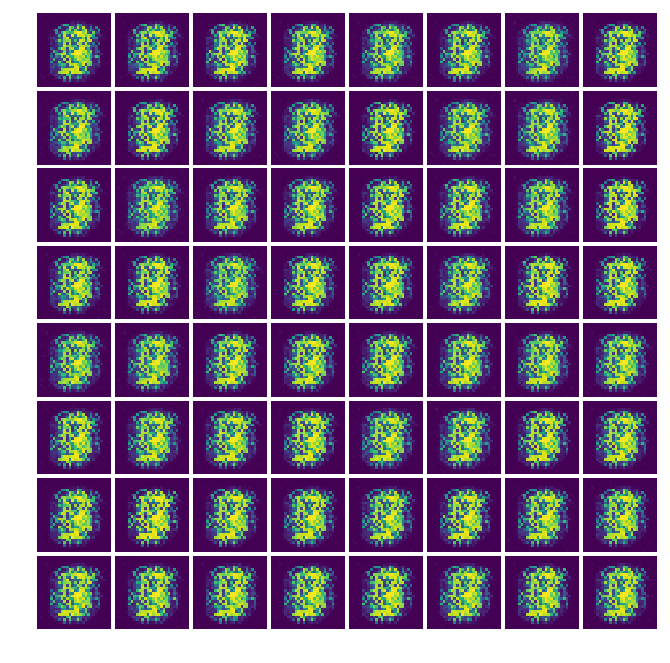

# GAN-tensorflow
 
Simple tensorflow implementation of Generative Adversarial Nets which generate MNIST data from TF. 

The paper of GAN is [here](url)

### Model

 
                                        GAN의 학습 과정 원리 <출처: 네이버랩스> 

## Prerequisition

- Python 3.6
- [Tensorflow 1.0.1](https://github.com/tensorflow/tensorflow/tree/r0.12)

## Run
    $ python3 GAN_train.py

## Result
All results are randomly sampled.

*Name* | *Epoch 1* | *Epoch 50* | *Epoch 100* | *Epoch 200*
:---: | :---: | :---: | :---: | :---: |
GAN |  |  |  | 

